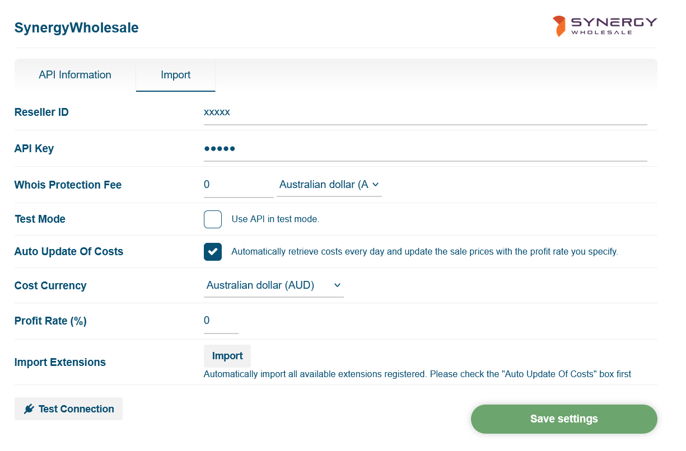

# Synergy Wholesale Registrar Module for WISECP

This module allows you to manage your Domains with Synergy Wholesale though WISECP.

**Note: Domain registration for most .AU domains cannot be automated at the moment with the WISECP API since it requires asking for an ABN verification and business type.**

API Features supported:

* Domain registration
* Domain transfer
* Whois modification
* Whois Privacy
* Nameserver Configuration
* Import of Domains already on Synergy Wholesale
* Automated Import of TLDs
* EPP Transfer Code

## Server Requirements

* PHP 7.2+
* cURL PHP Module

## Installation

1. Download the archive to your server
2. Extract the archive to the root of your WISECP installation

## Developer

### Dev Guides

https://dev.wisecp.com/en/kb/__construct

https://dev.wisecp.com/en/kb/cctld-gtld-whois-server

https://synergywholesale.com/faq/article/api-whmcs-modules/

Copyright (C) Schmidt IT
